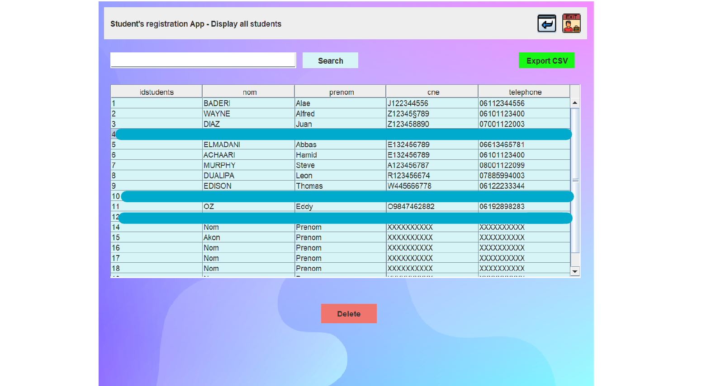

# StudentAPP

StudentAPP is a Java application designed to manage student records for schools. It follows the Model-View-Controller (MVC) architectural pattern and provides functionalities to interact with a PostgreSQL database to display, add, modify, and remove student records. Additionally, it allows users to export student data as a CSV file.

## Features

- **Model:** Represents the data and business logic of the application. It interacts with the database to perform CRUD operations on student records.
- **View:** Provides the user interface for interacting with the application. Users can view, add, modify, and remove student records using the graphical user interface.
- **Controller:** Acts as an intermediary between the model and view. It handles user input, processes requests, and updates the view based on changes in the model.





## Installation

1. Clone the repository:

    ```bash
    git clone https://github.com/Astronaum/StudentAPP.git
    cd StudentAPP
    ```

2. Set up the PostgreSQL database:
   - Update the database configuration details in the application properties file (`StudentAPP/src/DAO/MyJDBC.java`).

3. Build the application:

    ```bash
    mvn clean package
    ```

4. Run the application:

    ```bash
    java -jar target/studentapp.jar
    ```

## Usage

1. Launch the application.
2. Use the provided user interface to navigate through different functionalities.
3. View, add, modify, or remove student records as needed.
4. Use the export feature to generate a CSV file containing student data.

## Contributing

Contributions to StudentAPP are welcome! Follow these steps to contribute:

1. Fork the repository.
2. Create a new branch (`git checkout -b feature-branch`).
3. Make your changes and commit them (`git commit -am 'Add new feature'`).
4. Push to the branch (`git push origin feature-branch`).
5. Create a new pull request.
